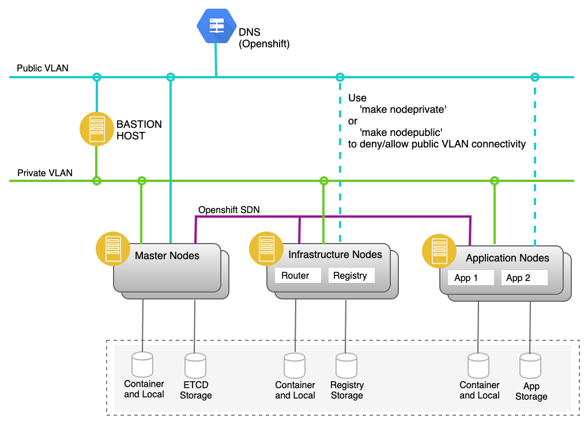

# terraform-ibm-openshift

Use this project to set up Red Hat® OpenShift Container Platform 3.11 on IBM Cloud, using Terraform.

## Overview

Deployment of 'OpenShift Container Platform on IBM Cloud' is divided into separate steps.

- Step 1: Provision the infrastructure on IBM Cloud <br>
  Use Terraform to provision the compute, storage, network, load balancers & IAM resources on IBM Cloud Infrastructure

- Step 2: Deploy OpenShift Container Platform on IBM Cloud <br>
  Install OpenShift Container Platform which is done using the Ansible playbooks - available in the https://github.com/openshift/openshift-ansible project.
  During this phase the router and registry are deployed.

- Step 3: Post deployment activities <br>
  Validate the deployment

The following figure illustrates the deployment architecture for the 'OpenShift Container Platform on IBM Cloud'.



## Prerequisite

- [IBM Cloud account](https://www.ibm.com/) (used to provision resources on IBM Cloud Infrastructure or SoftLayer)

- [RedHat Account with developer subscription](https://access.redhat.com/management/subscriptions)

  - To get developer subscription, sign up an account on https://www.redhat.com/en . Check your subscription from https://access.redhat.com/management/subscriptions

- [Docker Account](https://www.docker.com/)

* [Quay IO account](https://quay.io/)

* A custom domain needed, get from IBM Cloud or Godaddy or cloudfare.

## Steps run this project

### 1. Setup the IBM Terraform Openshift Project

- Clone the repo [IBM Terraform Openshift](https://github.ibm.com/icp-ap/terraform-ibm-openshift-modified)

  ```console
    # Clone the repo
    $ git clone https://github.ibm.com/icp-ap/terraform-ibm-openshift-modified
    $ cd terraform-ibm-openshift-modified/
  ```

- Generate the private and public key pair which is required to provision the virtual machines in softlayer.(Put the private key inside ~/.ssh/id_rsa).Follow the instruction [here](https://help.github.com/articles/generating-a-new-ssh-key-and-adding-it-to-the-ssh-agent/) to generate ssh key pair

* Rename `terraform.tfvars.example` to `terraform.tfvars`

* Fill in the value for all the variables inside `terraform.tfvars`
  - ibm_sl_username = "<your-username>" # Use your IBM Classical Infrastructure account username under IAM
  - ibm_sl_api_key = "<your key>" # Use your IBM Classical Infrastructure account password under IAM
  - datacenter = "sng01" #Use one of SoftLayer Datacenter code
  - oreg_auth_user="<>" # Use the redhat developer subscription username
  - oreg_auth_password="<>" # Use the redhat developer subscription password
  - docker_auth_user="<>" # Create account in https://www.docker.com/ and use the docker account username
  - docker_auth_password="<>" # Create account in https://www.docker.com/ and use the docker account password
  - quay_auth_user="<>" # Create account in quay.io and use your account username here
  - quay_auth_password="<>" # Create account in quay.io and use your account password here
  - rhn_username="<>" # Use the redhat developer subscription username
  - rhn_password="<>" # Use the redhat developer subscription password
  - hostname_prefix="dc-06-Dec" # The hostname you wish to have
  - vm_domain="ocp-cloud.com" # Match the name of FQDN in domain name service
  - storage_count=3 # The number of storage node, min is 3
  - path_to_rpms_at_media_server="http://10.66.216.183/repos/ppa/rhel-7-server-ansible-2.6-rpms/" #base url format in yum repo file. Change to your own media server where you put ocp rpms.
  - path_to_ansible_rpms_at_media_server="http://10.66.216.183/repos/ppa/rhel-7-server-ansible-2.6-rpms/" #base url format in yum repo file. Change to your own media server where you put ocp rpms.
  - path_to_ose_rpms_at_media_server="http://10.66.216.183/repos/ppa/rhel-7-server-ose-3.11-rpms/" #base url format in yum repo file. Change to your own media server where you put ocp rpms.

### 2. Provision the IBM Cloud Infrastructure for Red Hat® OpenShift

- Update variables.tf file

- Provision the infrastructure using the following command

  ```console
   $ make infrastructure
  ```

  Please provide softlayer username , password and ssh public key to proceed.

In this version, the following infrastructure elements are provisioned for OpenShift (as illustrated in the picture)

- Bastion node
- Master node
- Infra node
- App node
- Storage node (if enabled for glusterfs configuration)
- Security groups for these nodes

On successful completion, you will see the following message

```
...

Apply complete! Resources: 63 added, 0 changed, 0 destroyed.

```

### 3. Setup Red Hat® Repositories and images

- Install the repos and images by running :

  ```console
    $ make rhnregister
  ```

This step includes the following:

- Register the nodes to the Red Hat® Network,

### 4. Deploy OpenShift Container Platform on IBM Cloud Infrastructure

To install OpenShift on the cluster, just run:

```console
 $ make openshift
```

This step includes the following:

- Prepare the Master, Infra and App nodes before installing OpenShift
- Finally, install OpenShift Container Platform v3.

using installation procedure described [here](https://docs.openshift.com/container-platform/3.11/install/running_install.html).

Once the setup is complete, just run:

```console
 $ open https://$(terraform output master_public_ip):8443/console
```

Note: Add IP and Host Entry in /etc/hosts

This figure illustrates the 'Red Hat Openshift Console'


To open a browser to admin console, use the following credentials to login:

```console
 Username: admin
 Password: test123
```

## Work with OpenShift

- Login to the master node

  ```console
   $ ssh -t -A root@$(terraform output master_public_ip)
  ```

  Default project is in use and the core infrastructure components (router etc) are available.

- Login to openshift client by running

  ```console
    $ oc login https://$(terraform output master_public_ip):8443
  ```

  Provide username as admin and password as test123 to login to the openshift client.

- Create new project

  ```console
   $ oc new-project test

  ```

- Deploy the app

  ```console
   $ oc new-app --name=nginx --docker-image=bitnami/nginx

  ```

- Expose the service

  ```console
   $ oc expose svc/nginx

  ```

- Edit the service to use nodePort by changing type as NodePort

  ```console
   $ oc edit svc/nginx

  ```

  Access the deployed application at

  ```console
   $ oc get routes

  ```

  ```
  {HOST/PORT} get the value from above command
  Access the deployed application at http${HOST/PORT}

  ```

## Destroy the OpenShift cluster

Bring down the openshift cluster by running following

```console
 $ make destroy

```

## Troubleshooting

\[Work in Progress\]

# References

- https://github.com/dwmkerr/terraform-aws-openshift - Inspiration for this project

- https://github.com/ibm-cloud/terraform-provider-ibm - Terraform Provider for IBM Cloud

- [Deploying OpenShift Container Platform 3.11](https://docs.openshift.com/container-platform/3.11/install/index.html)

- [To create more users and provide admin privilege](https://docs.openshift.com/container-platform/3.11/install_config/configuring_authentication.html)

- [Accessing openshift registry](https://docs.openshift.com/container-platform/3.11/install_config/registry/index.html)

- [Refer Openshift Router](https://docs.openshift.com/container-platform/3.11/install_config/router/index.html)

### This module will add functionality for adding trusted digital certificate using Let's Encrypte

https://certbot.eff.org/lets-encrypt/osx-other.html

https://www.ibm.com/cloud/blog/use-ibm-cloud-certificate-manager-to-obtain-lets-encrypt-tls-certificates-for-your-public-domains

https://cloud.ibm.com/docs/services/certificate-manager?topic=certificate-manager-configuring-notifications#examples

https://medium.com/@MicroPyramid/letsencrypt-wildcard-setup-wildcard-subdomain-using-letsencrypt-and-certbot-97ffb17414dd

https://www.ibm.com/cloud/blog/secure-apps-on-ibm-cloud-with-wildcard-certificates

```sh
# Using this to run letsencrypt
git clone https://github.com/certbot/certbot
cd certbot
./certbot-auto certonly --manual
# The program will ask you fews question.
# Ask below example
[root@dc-06-dec-d9fccc1737-bastion certbot]# ./certbot-auto certonly --manual
Saving debug log to /var/log/letsencrypt/letsencrypt.log
Plugins selected: Authenticator manual, Installer None
Please enter in your domain name(s) (comma and/or space separated)  (Enter 'c'
to cancel): *.ocp-cloud.com
Obtaining a new certificate
Performing the following challenges:
dns-01 challenge for ocp-cloud.com

- - - - - - - - - - - - - - - - - - - - - - - - - - - - - - - - - - - - - - - -
NOTE: The IP of this machine will be publicly logged as having requested this
certificate. If you're running certbot in manual mode on a machine that is not
your server, please ensure you're okay with that.

Are you OK with your IP being logged?
- - - - - - - - - - - - - - - - - - - - - - - - - - - - - - - - - - - - - - - -
(Y)es/(N)o: Y

- - - - - - - - - - - - - - - - - - - - - - - - - - - - - - - - - - - - - - - -
Please deploy a DNS TXT record under the name
_acme-challenge.ocp-cloud.com with the following value:

8e1-XMPNYy3U9YrszbLxoJibIrYXgWAQJ_Xap1IFtCc

Before continuing, verify the record is deployed.
- - - - - - - - - - - - - - - - - - - - - - - - - - - - - - - - - - - - - - - -
Press Enter to Continue^[[A
Waiting for verification...
Cleaning up challenges

IMPORTANT NOTES:
 - Congratulations! Your certificate and chain have been saved at:
   /etc/letsencrypt/live/ocp-cloud.com/fullchain.pem
   Your key file has been saved at:
   /etc/letsencrypt/live/ocp-cloud.com/privkey.pem
   Your cert will expire on 2020-03-13. To obtain a new or tweaked
   version of this certificate in the future, simply run certbot-auto
   again. To non-interactively renew *all* of your certificates, run
   "certbot-auto renew"
 - If you like Certbot, please consider supporting our work by:

   Donating to ISRG / Let's Encrypt:   https://letsencrypt.org/donate
   Donating to EFF:                    https://eff.org/donate-le

# You will need to update <_acme-challenge> record in the cloud


```

- Using this tools to validate the dns entry update, dns txt , dns A record
  https://toolbox.googleapps.com/apps/dig/#TXT/

### For Openshift 4,

https://blog.openshift.com/requesting-and-installing-lets-encrypt-certificates-for-openshift-4/

### For openshift 3, Deployment after you gotten the cert file from letsencrypt

### [2 modes: Deployed cluster can run redeploy.yaml](https://docs.openshift.com/container-platform/3.11/install_config/redeploying_certificates.html#redeploying-all-certificates-current-ca)

https://www.redpill-linpro.com/sysadvent/2017/12/15/letsencrypt-on-openshift.html

Requesting a certificate

We can now request a certificate from Let’s Encrypt by using:

- certbot certonly --standalone --preferred-challenges http --http-01-port 8080 --http-01-address 127.0.0.1 -m admin@example.com -d ocp.example.com

If everything is configured correctly, you end up with a private key and the certificates under /etc/letsencrypt/live/ocp.example.com/:

```
/etc/letsencrypt/live/ocp.example.com/cert.pem
/etc/letsencrypt/live/ocp.example.com/privkey.pem
/etc/letsencrypt/live/ocp.example.com/chain.pem
/etc/letsencrypt/live/ocp.example.com/fullchain.pem
```

Certificate used by OpenShift API

- We can now proceed to install and use the certificate from Let’s Encrypt for the OpenShift API. This is done by adding the following to your Ansible inventory file for OpenShift:

```sh
openshift_master_named_certificates=[{"certfile":"/etc/letsencrypt/live/ocp.example.com/fullchain.pem","keyfile":"/etc/letsencrypt/live/ocp.example.com/privkey.pem"}]
openshift_master_overwrite_named_certificates=true

# In our context
openshift_master_named_certificates=[{"certfile":"/etc/letsencrypt/live/ocp-cloud.com/fullchain.pem","keyfile":"/etc/letsencrypt/live/ocp-cloud.com/privkey.pem"}]
openshift_master_overwrite_named_certificates=true

# In our context
openshift_master_named_certificates=[{"certfile":"/root/ocp-cloud.com/fullchain.pem","keyfile":"/root/ocp-cloud.com/privkey.pem"}]
openshift_master_overwrite_named_certificates=true

# When you need to have confiure router too,
# follow this https://access.redhat.com/documentation/en-us/openshift_container_platform/3.11/html/configuring_clusters/install-config-certificate-customization
openshift_master_named_certificates=[{"certfile":"/root/ocp-cloud.com/fullchain.pem","keyfile":"/root/ocp-cloud.com/privkey.pem"}]
openshift_hosted_router_certificate={"certfile": "/root/ocp-cloud.com/fullchain.pem", "keyfile": "/root/ocp-cloud.com/privkey.pem", }
openshift_master_overwrite_named_certificates=true

```

and (re-)running the Ansible playbook to configure OpenShift, thereby installing the named certificate on your masters:

```
ansible-playbook -i /root/inventory.cfg \
    /usr/share/ansible/openshift-ansible/playbooks/openshift-master/redeploy-openshift-ca.yml
```

- Conclusion:
  Failed, faced this issue : Volume heketidbstorage is not ready while upgrading Openshift
  solution: https://access.redhat.com/solutions/3683031

`ansible-playbook /usr/share/ansible/openshift-ansible/playbooks/byo/openshift-cluster/config.yml`

After this, you should no longer receive any warnings about an unknown certificate authority within your web-browser or from the oc command line interface.
