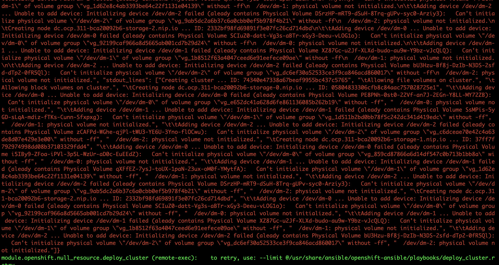

# Here listed some of the precaution to take note


### To install ocp 3.11

The following repo is needed

```yaml
 subscription-manager repos \
    --enable="rhel-7-server-rpms" \
    --enable="rhel-7-server-extras-rpms" \
    --enable="rhel-7-server-ose-3.11-rpms" \
    --enable="rhel-7-server-ansible-2.6-rpms"
```

* If you are using ibm cloud for deployment, the following repo is enable by default
```
    --enable="rhel-7-server-rpms" \
```

* The following repo is granted but not enable by default

```
  --enable="rhel-7-server-extras-rpms" \
```

* The following repo must get from subscription

```
   --enable="rhel-7-server-ose-3.11-rpms" \
    --enable="rhel-7-server-ansible-2.6-rpms"
```

      That is where you may use ibm binary file download from passport advantage.
      In the script in setup_repo.sh where get those rpms from a web server which have all the rpms.


### About Inventory file for OCP 3.11

1. Oreg_url can do not included but need to have the sign in credential associated.

2.  `openshift_hosted_metrics_deploy=true` and `openshift_metrics_install_metrics=true` cannot co-exist in the inventory file

3. You need to enable 


4. Glusterfs storage instance number must have at least 3 and above


5. Glusterfs storage instance disk must be empty when you perform installation




- You may empty the disk by using `pvremove -ff -y <disk name>`, `lvremove -ff -y <disk name>`, `vgremove -ff -y <disk name>`
- Check and validate by using `lvdisplay`, `pvdisplay`, `vgdisplay`
- Need to make sure all the command return nothing then you can proceed


5. If you uninstall ocp 3.11 and intend to reinstall, please make sure the file `/etc/resolv.conf` are pointing to correct dns ip

- Because while ocp install, it will configure the `/etc/resolv.conf` to be internal accessible only.


### Issue 


1. OCP Logging issue

Root cause: Unknown


Solution: Unknown

Some information: https://access.redhat.com/solutions/3882461

2. OCP Reinstall issue

Root cause:
Install on top of running ocp 3.11


Solution: 
Uninstall then install


3. Web console install failed

- You can troubleshot by using `kubectl get pods --all-namespaces` and `systemctl status docker -l`
- Then log the output `oc logs pods/webconsole-7f7f679596-wtv2r   -n openshift-web-console` or `oc logs pod/sdn-sksqn -n openshift-sdn`


Root cause: The openshift-sdn container cannot start
```yaml


Issue
Raw

Aug 22 15:38:47 master.examplecom atomic-openshift-node[30443]: F0822 15:38:47.529156   30443 start_node.go:140] could not start DNS, unable to read config file: open /etc/origin/node/resolv.conf: no such file or directory
Aug 22 15:38:47 master.example.com systemd[1]: atomic-openshift-node.service: main process exited, code=exited, status=255/n/a
Aug 22 15:38:47 master.example.com systemd[1]: Failed to start OpenShift Node.
Aug 22 15:38:47 master.example.com systemd[1]: Unit atomic-openshift-node.service entered failed state.
Aug 22 15:38:47 master.example.com systemd[1]: atomic-openshift-node.service failed.
Aug 22 15:38:52 master.example.com systemd[1]: atomic-openshift-node.service holdoff time over, scheduling restart.
Aug 22 15:38:52 master.example.com systemd[1]: Starting OpenShift Node...

    Unable to install OpenShift


Root Cause

This is a know bug that is caused when no IP4_NAMESERVERS are set or "NM_CONTROLLED=no" is set on the default interface.

There is also bug 1500978 where the watermark, 99-origin-dns.sh, is already set in resolv.conf resulting in /etc/origin/node/resolv.conf never being created.


```


Solution: 
https://access.redhat.com/solutions/3165971


```

Resolution

On each node, run:
Raw

# echo "nameserver 8.8.8.8" >  /etc/origin/node/resolv.conf

Be sure DNS prerequisites have been met.

```


4. Network Issue

- Solution:
Make sure /etc/sysconfig/network-scripts/ifcfg-eth0 ==> NM_CONTROLLED preperties is configure to 'yes'

/etc/sysconfig/network-scripts/ifcfg-eth0
/etc/sysconfig/network-scripts/ifcfg-eth1

```correct
BOOTPROTO=static
DEVICE=eth0
HWADDR=06:db:46:f5:7d:aa
IPADDR=10.64.176.222
NETMASK=255.255.255.192
ONBOOT=yes
```

```incorrect
DEVICE="eth0"
BOOTPROTO="static"
GATEWAY="192.168.0.1"
HWADDR="00:11:22:33:44:56"
IPADDR="192.168.0.10"
NETMASK="255.255.255.0"
NM_CONTROLLED="yes"
ONBOOT="yes"
```

https://access.redhat.com/solutions/44839

5. Service Catalog installation failed

Why service catalog is not getting deployed and is failing with bad certificate errors? 


Solution:
https://access.redhat.com/solutions/4364951


6. dnsmasq does not configure properly on master node

https://serverfault.com/questions/907500/how-to-debug-dnsmasq-requiring-a-service-restart-in-order-to-work

Solution adjust the file in /etc/origin
```yaml

cat /etc/dnsmasq.d/origin-dns.conf 

no-resolv  # Change
domain-needed
no-negcache
max-cache-ttl=1
enable-dbus
dns-forward-max=10000
cache-size=10000
bind-dynamic
min-port=1024
except-interface=lo
# End of config
```


7. `hostname` and `hostname -f` is different thing, when deploying, need to make sure both are the same

https://access.redhat.com/solutions/3680401

8. Cannot add this in , Will cause problem


```
#Update the docker config to allow OpenShift's local insecure registry. 
sed -i '/OPTIONS=.*/c\OPTIONS="--selinux-enabled --insecure-registry 172.30.0.0/16 --log-driver=json-file --log-opt max-size=1M --log-opt max-file=3"' /etc/sysconfig/docker
systemctl restart docker
```


##### Lastly, Successful installation will show like this


